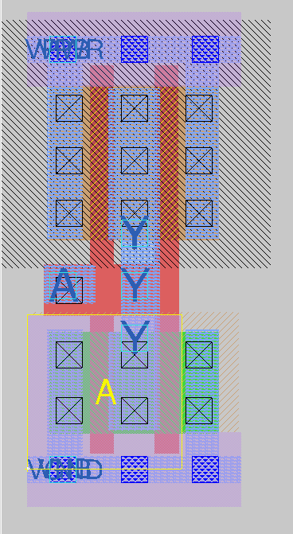
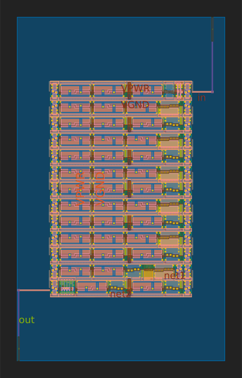
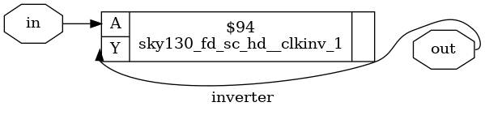
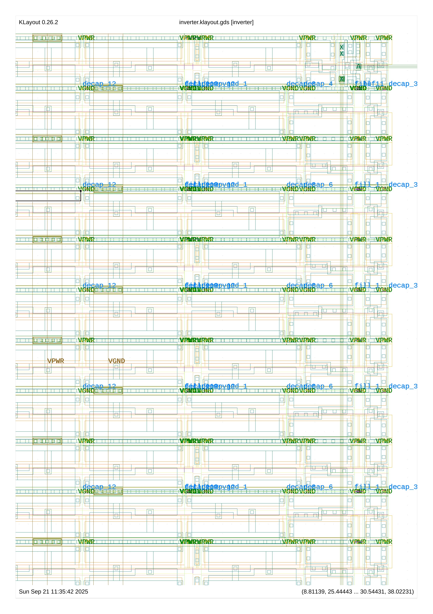

# Inverter RTL-to-GDSII Flow using OpenLane and SkyWater 130nm PDK


<p align="center">
  <table>
    <tr>
      <td align="center">
        <br/>
        <em>Figure 0: Magic layout view of the SKY130 standard cell inverter (inv_2)</em>
      </td>
      <td align="center">
        <br/>
        <em>Figure 1: Generated from final GDS</em>
      </td>
    </tr>
  </table>
</p>


<p align="center">
  
  <br/>
  <em>Figure 1: RTL schematic (left) and Gate-level schematic after tech mapping (right)</em>
</p>


<p align="center">
  <br/>
  <em>Figure 2: Floorplan of inverter after OpenLane flow</em>
</p>

<p align="center">
  
  <br/>
  <em>Figure 3: Placement (left) and Routing (right) stages of physical design</em>
</p>

<p align="center">
  
  
  <br/>
  <em>Figure 4: Final signoff view of inverter layout (zoomed detail on left)</em>
</p>

This repository demonstrates the complete ASIC design flow for a simple **inverter** — from **RTL (Verilog)** to **GDSII** — using the **OpenLane** toolchain and the **SkyWater 130nm PDK (sky130)**.

The flow covers:

* RTL simulation and verification
* Logic synthesis with Yosys
* Floorplanning, placement, CTS, and routing with OpenLane/OpenROAD
* Sign-off checks (DRC/LVS) using Magic/KLayout
* Waveform analysis with GTKWave

---

## Repository Structure

```bash
jagadeesh97@LAPTOP-BJUEJNDK:~/OpenLane/designs/inverter$ tree -L 3
.
├── config.json
├── config.tcl
├── klayout_floorplan_inverter.png
├── klayout_placement_inverter.png
├── klayout_routing_inverter.png
├── klayout_signoff_inverter.png
├── klayout_signoff_inverter_z.png
├── runs
│   └── myrun
│       ├── OPENLANE_COMMIT
│       ├── PDK_SOURCES
│       ├── cmds.log
│       ├── config.tcl
│       ├── logs
│       ├── openlane.log
│       ├── reports
│       ├── results
│       ├── runtime.yaml
│       ├── tmp
│       └── warnings.log
├── sim
│   ├── inverter_sim
│   └── inverter_tb.v
├── src
│   └── inverter.v
├── synth.ys
└── yosys-reports
    ├── inverter_flat_netlist.dot
    ├── inverter_flat_netlist.png
    ├── inverter_gatelevel.dot
    ├── inverter_gatelevel.json
    ├── inverter_gatelevel.png
    ├── inverter_gatelevel.v
    ├── inverter_hierarchy.dot
    ├── inverter_hierarchy.png
    ├── inverter_mapped.json
    ├── inverter_mapped.v
    ├── inverter_rtl.dot
    ├── inverter_rtl.png
    ├── inverter_synth.blif
    ├── inverter_synth.edf
    ├── inverter_synth.json
    ├── inverter_synth.v
    ├── inverter_synth_clean.json
    ├── inverter_synth_clean.v
    ├── module_inverter.dot
    └── module_inverter.png

9 directories, 38 files
```

---

## 1. RTL Simulation

RTL functionality is validated before synthesis.

Compile and simulate:

```bash
iverilog -o sim/inverter_sim sim/inverter_tb.v src/inverter.v
vvp sim/inverter_sim
```

Output from testbench:

```
Time    in      out
0       0       1
10000   1       0
20000   0       1
30000   1       0
Testbench finished
```

View waveform:

```bash
gtkwave sim/inverter.vcd
```

---

## 2. Logic Synthesis (Yosys)

Run Yosys with the provided script:

```bash
yosys synth.ys
```

### synth.ys

<details>
<summary>Click to expand</summary>

```tcl
# ===============================
# Yosys Synthesis Script - Inverter
# ===============================

# Create report directory
# mkdir -p yosys-reports

# 1. Read Design
read_verilog src/*.v
hierarchy -check
synth -top inverter

# 2. Optimization and Checks
proc; opt; fsm; opt; memory; opt
check > yosys-reports/inverter_check.txt
stat > yosys-reports/inverter_stat.txt

# 3. Save Netlists
write_verilog yosys-reports/inverter_synth.v
write_json yosys-reports/inverter_synth.json
write_edif yosys-reports/inverter_synth.edf
write_blif yosys-reports/inverter_synth.blif
write_verilog yosys-reports/inverter_synth_clean.v
write_json yosys-reports/inverter_synth_clean.json

# 4. RTL Diagram
show -format dot -prefix yosys-reports/inverter_rtl

# 5. Hierarchy Diagram
hierarchy -top inverter
show -format dot -prefix yosys-reports/inverter_hierarchy

# 6. Flat Netlist
flatten
show -format dot -prefix yosys-reports/inverter_flat_netlist

# 7. Technology Mapping
techmap; opt
stat -tech xilinx > yosys-reports/inverter_techmap_stat.txt
write_verilog yosys-reports/inverter_mapped.v
write_json yosys-reports/inverter_mapped.json

# 8. Module Graph
show -format dot -prefix yosys-reports/module_inverter

# 9. Rough Timing Analysis (using Sky130 Liberty)
abc -liberty /usr/share/yosys/techlibs/sky130_fd_sc_hd/sky130_fd_sc_hd__tt_025C_1v80.lib
stat > yosys-reports/inverter_abc_stat.txt

# Done
echo "All Yosys reports saved in yosys-reports/"
```

</details>

This generates netlists, reports, and `.dot` diagrams which can be converted into `.png` using Graphviz.

---

## 3. Physical Design with OpenLane

Initialize:

```bash
./flow.tcl -design inverter -init_design_config -add_to_designs
```

Run:

```bash
./flow.tcl -design inverter -tag myrun -overwrite
```

### config.tcl

<details>
<summary>Click to expand</summary>

```tcl
# Design setup
set ::env(DESIGN_NAME) "inverter"
set ::env(VERILOG_FILES) "$::env(DESIGN_DIR)/src/inverter.v"

# Clock settings (required for STA, even for combinational logic)
set ::env(CLOCK_PORT) "clk"
set ::env(CLOCK_PERIOD) 10.0

# Floorplan sizing
set ::env(FP_SIZING) "absolute"
set ::env(DIE_AREA) "0 0 200 200"

# Power distribution network
set ::env(FP_PDN_CORE_RING) 0
set ::env(FP_PDN_AUTO_ADJUST) 1
```

</details>

Results (logs, reports, GDS) are stored in `runs/myrun/`.

---

## 4. Layout and Signoff

View final GDS:

```bash
klayout runs/myrun/results/final/gds/inverter.gds
```

Check DRC and LVS with Magic and Netgen.

Representative layout images are included:

* Floorplan: `klayout_floorplan_inverter.png`
* Placement: `klayout_placement_inverter.png`
* Routing: `klayout_routing_inverter.png`
* Final signoff: `klayout_signoff_inverter.png`

---

## 5. Tools Used

* SkyWater 130nm PDK (sky130)
* OpenLane (flow orchestration)
* Yosys (synthesis)
* OpenROAD (PnR)
* Magic / KLayout (layout, DRC)
* Netgen (LVS)
* Icarus Verilog / GTKWave (simulation)

---

## Usage Notes

* `PDK_ROOT` must point to the SkyWater PDK installation.
* `OPENLANE_ROOT` must be set before invoking OpenLane.
* Use Dockerized OpenLane for consistency.
* Convert `.dot` files from Yosys to `.png` with Graphviz.

---

## Final Output

* RTL simulation results (`sim/`)
* Gate-level netlists and diagrams (`yosys-reports/`)
* Physical design results, reports, and GDSII (`runs/myrun/`)
* Verified inverter layout snapshots


## METRICS

| design | design_name | config | flow_status | total_runtime | routed_runtime | (Cell/mm²)/Core_Util | DIEAREA_mm² | CellPer_mm² | OpenDP_Util | Final_Util | Peak_Memory_Usage_MB | synth_cell_count | tritonRoute_violations | Short_violations | MetSpc_violations | OffGrid_violations | MinHole_violations | Other_violations | Magic_violations | pin_antenna_violations | net_antenna_violations | lvs_total_errors | cvc_total_errors | klayout_violations | wire_length | vias | wns | pl_wns | optimized_wns | fastroute_wns | spef_wns | tns | pl_tns | optimized_tns | fastroute_tns | spef_tns | HPWL | routing_layer1_pct | routing_layer2_pct | routing_layer3_pct | routing_layer4_pct | routing_layer5_pct | routing_layer6_pct | wires_count | wire_bits | public_wires_count | public_wire_bits | memories_count | memory_bits | processes_count | cells_pre_abc | AND | DFF | NAND | NOR | OR | XOR | XNOR | MUX | inputs | outputs | level | DecapCells | WelltapCells | DiodeCells | FillCells | NonPhysCells | TotalCells | CoreArea_um² | power_slowest_internal_uW | power_slowest_switching_uW | power_slowest_leakage_uW | power_typical_internal_uW | power_typical_switching_uW | power_typical_leakage_uW | power_fastest_internal_uW | power_fastest_switching_uW | power_fastest_leakage_uW | critical_path_ns | suggested_clock_period | suggested_clock_frequency | CLOCK_PERIOD | FP_ASPECT_RATIO | FP_CORE_UTIL | FP_PDN_HPITCH | FP_PDN_VPITCH | GRT_ADJUSTMENT | GRT_REPAIR_ANTENNAS | MAX_FANOUT_CONSTRAINT | PL_TARGET_DENSITY | RUN_HEURISTIC_DIODE_INSERTION | STD_CELL_LIBRARY | SYNTH_STRATEGY |
|--------|-------------|--------|-------------|---------------|----------------|---------------------|-------------|-------------|-------------|------------|--------------------|-----------------|-----------------------|-----------------|-----------------|------------------|------------------|-----------------|-----------------|------------------------|----------------------|----------------|----------------|------------------|------------|------|-----|--------|---------------|---------------|-----------|-----|--------|---------------|---------------|-----------|------|-----------------|-----------------|-----------------|-----------------|-----------------|-----------------|-------------|-----------|-----------------|----------------|----------------|-------------|----------------|---------------|-----|-----|------|-----|----|-----|-----|-----|--------|--------|-------|------------|--------------|-----------|----------|--------------|------------|--------------|-------------------------|--------------------------|------------------------|--------------------------|---------------------------|-------------------------|----------------------------|----------------------------|-------------------------|-----------------|----------------------|------------------------|--------------|----------------|-------------|---------------|---------------|----------------|--------------------|-------------------|----------------|-----------------------------|-----------------|----------------|
| /openlane/designs/inverter | inverter | myrun | flow completed | 0h1m10s0ms | 0h0m52s0ms | 150.0 | 0.04 | 75.0 | 0.01 | -1 | 481.91 | 1 | 0 | 0 | 0 | 0 | 0 | 0 | 0 | 0 | 0 | 0 | -1 | -1 | 384 | 12 | 0.0 | -1 | -1 | -1 | 0.0 | 0.0 | -1 | -1 | -1 | 0.0 | 393000.0 | 0.0 | 0.32 | 0.35 | 0.0 | 0.0 | 0.0 | 2 | 2 | 2 | 2 | 0 | 0 | 0 | 1 | 0 | 0 | 0 | 0 | 0 | 0 | 0 | 0 | 1 | 1 | 1 | 2483 | 469 | 0 | 477 | 3 | 3432 | 33344.48 | -1 | -1 | -1 | 4.14e-07 | 1.33e-06 | 1.96e-09 | -1 | -1 | -1 | 0.52 | 10.0 | 100.0 | 10.0 | 1 | 50 | 153.18 | 153.6 | 0.3 | 1 | 10 | 0.6 | 0 | sky130_fd_sc_hd | AREA 0 |

## REPORTS

```
Final reports at: runs\myrun\reports

File Name                                         report_tns               report_wns               report_worst_slack -max  report_worst_slack -min  
------------------------------------------------------------------------------------------------------------------------------------------------------
synthesis\2-syn_sta.summary.rpt                   0.00                     0.00                     5.61                     3.84                     
cts\12-cts_sta.summary.rpt                        0.00                     0.00                     5.40                     4.05                     
cts\13-cts_sta.summary.rpt                        0.00                     0.00                     5.30                     4.14                     
placement\10-dpl_sta.summary.rpt                  0.00                     0.00                     5.40                     4.05                     
placement\11-dpl_sta.summary.rpt                  0.00                     0.00                     5.30                     4.14                     
placement\8-gpl_sta.summary.rpt                   0.00                     0.00                     5.52                     3.93                     
routing\15-rsz_design_sta.summary.rpt             0.00                     0.00                     5.41                     4.05                     
routing\16-rsz_design_sta.summary.rpt             0.00                     0.00                     5.28                     4.16                     
routing\17-rsz_timing_sta.summary.rpt             0.00                     0.00                     5.41                     4.05                     
routing\18-rsz_timing_sta.summary.rpt             0.00                     0.00                     5.28                     4.16                     
routing\20-grt_sta.summary.rpt                    0.00                     0.00                     5.44                     4.03                     
routing\21-grt_sta.summary.rpt                    0.00                     0.00                     5.44                     4.02                     
signoff\25-mca\rcx_min_sta.summary.rpt            0.00                     0.00                     5.10                     3.96                     
signoff\26-mca\rcx_min_sta.summary.rpt            0.00                     0.00                     4.86                     4.04                     
signoff\27-mca\rcx_max_sta.summary.rpt            0.00                     0.00                     5.09                     3.96                     
signoff\28-mca\rcx_max_sta.summary.rpt            0.00                     0.00                     4.81                     4.05                     
signoff\29-mca\rcx_nom_sta.summary.rpt            0.00                     0.00                     5.10                     3.96                     
signoff\30-mca\rcx_nom_sta.summary.rpt            0.00                     0.00                     4.83                     4.05                     
signoff\30-rcx_sta.summary.rpt                    0.00                     0.00                     5.39                     4.06                     
signoff\31-rcx_sta.summary.rpt                    0.00                     0.00                     5.23                     4.19                     

```